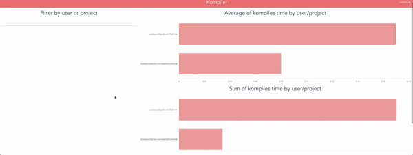

# Kompile

Kompile is a simple web application to know how much time you spend kompiling every day. It is split in two different parts, an API which is in charge to save the kompiling times and a web application which is the frontend of the application.

API is written in NodeJS and the web application is built with VueJS.

This project is done to have fun comparing teammates build times and laugh at the slowest :smiley:

## How to deploy?

### Docker

Docker is used to deploy this project.

#### Requirements 
- Docker

#### Run
- ./scripts/start.sh

This script runs these two commands to initialize Dockers containers:
- docker-compose build
- docker-compose up -d

#### Update version

- ./scripts/update.sh

This script saves the already created sqlite database and restart Dockers containers

## How to calculate build time?

This depends on which technology you are using in your project. Kompile has some related projects to calculate it in an easy way. We are open to add some related projects to measure build times in different technologies and then send it to Kompile API.

## Related projects

- [Kompile Gradle Plugin](https://github.com/josedlpozo/Kompile-Gradle-Plugin)

# License

    Copyright (C) 2018 josedlpozo

    Licensed under the Apache License, Version 2.0 (the "License");
    you may not use this file except in compliance with the License.
    You may obtain a copy of the License at

       http://www.apache.org/licenses/LICENSE-2.0

    Unless required by applicable law or agreed to in writing, software
    distributed under the License is distributed on an "AS IS" BASIS,
    WITHOUT WARRANTIES OR CONDITIONS OF ANY KIND, either express or implied.
    See the License for the specific language governing permissions and
    limitations under the License.